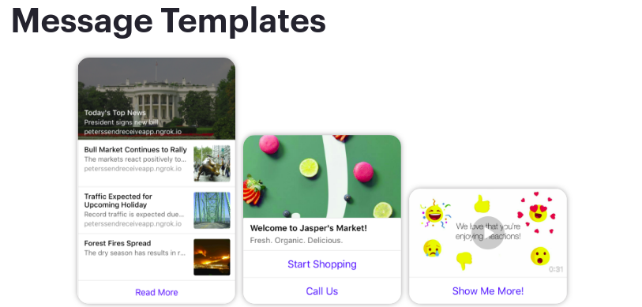
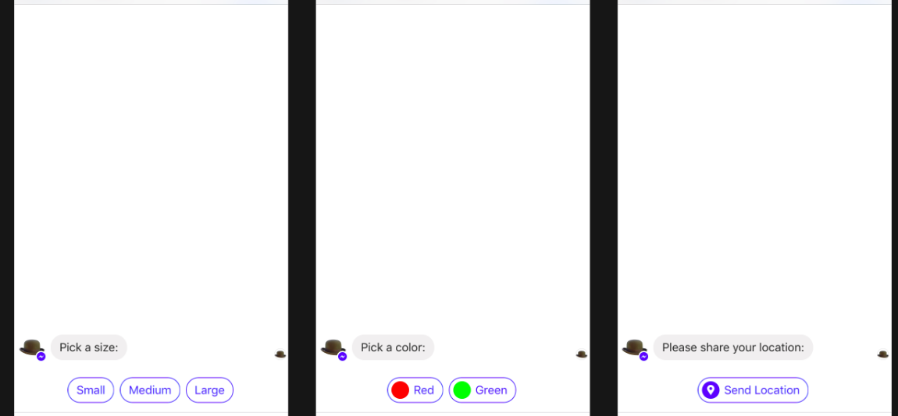

# Messenger-bot-python-skeleton
A simple python functions to implement all messenger bot functionalities. You can use the functions in the MainTask.py file to do most of the things required by the Messenger API 

## Functions
Here are the list of functions avialable and what you can do with them. The first two functions are used to handle the GET and POST request that are being sent to your App, i.e ```handleIncomingGet()``` and ```handleIncomingPost()```
In the ```handleIncomingPost()``` the code take cares of everything being sent to our post you can edit the default actions being performed to your preferences. For example if a bot user sends a text message we fire the ```handle_incoming_text(sender_id, messages)``` function.
Here are some of the basic functions and how they work...

### 1. send_text_message
Used to send back message to the bot user. The parameters required by this funcion are the user_id which we will have access to once a user sends a message to our bot and the other parameter is th text message that we need to send to the user.

### 2. send_templates
This function is used to send template messages to your bot user. Just like this ones...


The function takes two basic parameter and one optional parameter. The first parameter is the user_id we want to send the template to and the second parameter(elements) is an array of the elements which our message will contain like text, buttons and images. Here is the basic form of how a generic template element will look like.
```py
[
           {
            "title":"Welcome!",
            "image_url":"https://url_to_image",
            "subtitle":"The subtitle of our message",
            "default_action": {
              "type": "web_url",
              "url": "https://petersfancybrownhats.com/view?item=103",
              "messenger_extensions": false,
              "webview_height_ratio": "tall",
              "fallback_url": "https://petersfancybrownhats.com/"
            },
            "buttons":[
              {
                "type":"web_url",
                "url":"https://petersfancybrownhats.com",
                "title":"View Website"
              },{
                "type":"postback",
                "title":"Start Chatting",
                "payload":"DEVELOPER_DEFINED_PAYLOAD"
              }              
]
```
You can find different kind of template forms and examples at the Facebook developer Messenger documentation website https://developers.facebook.com/docs/messenger-platform. 
The third parameter is the type of template we are sending to our user currently we have got ```generic , list , button , open_graph , receiept , airline , media ``` template types. By default the function uses generic template type. For more insight visit: https://developers.facebook.com/docs/messenger-platform/send-messages/templates#available_templates

### 3. send_quick_replies
We can use this function to send quick replies to our user. 

The function takes three basic parameters, the first one being the user_id of the recipient. The second parameter is the message we want to send with our quick replies and the last parameter will be the element array which we will use to describe type and contents of our quick reply buttons. here is how the form of our element can be...
```py
[
    {
  "content_type":"text",
  "title":"<BUTTON_TEXT>",
  "image_url":"http://example.com/img/red.png",
  "payload":"<DEVELOPER_DEFINED_PAYLOAD>"
 },
{
  "content_type":"location"  // FOR lOCATION
}
]
```
For more insights visit: https://developers.facebook.com/docs/messenger-platform/send-messages/quick-replies

### 4. send_buttoned_messages
This function is used to send messages with buttons. Then we can use the reply of the user and do some actions like opening a webview or send a follow up message. Buttons in quick replies and templates have this functionality so we can also do actions based on user replies on those casses as well. This function have three basic parameters the first as always is the user_id of the recipient. The second is the message we want to show the user. In the last parameter we give the function an array of the button elements. Here is how the form of our element can be...

```py
[
    {
  "type": "postback",
  "title": "<BUTTON_TEXT>",
  "payload": "<STRING_SENT_TO_WEBHOOK>" //you can read this response in your code.
    },
    {
  "type": "web_url",
  "url": "<URL_TO_OPEN_IN_WEBVIEW>",
  "title": "<BUTTON_TEXT>",
    }

]
```
We can also use the format above as buttons for templates as well. For more insight visit: https://developers.facebook.com/docs/messenger-platform/send-messages/buttons

### 5. send_attachment
Using this functions you can send images, voice, video or file messages to your user. The function take three parameters. user_id, the second parameter the url to the attachment file and in the third parameter takes a string defining the type of attachment. Currently there are four types of attachemts ```image , audio , video , file``` .

## Note
- Set your facebook acess token on an environment variable as ```PAGE_ACCESS_TOKEN```
- You can use the default handle functions to handle incoming messages or create your own function and call them from the ```handleIncomingPost()``` function based on the type of messages the user sends
